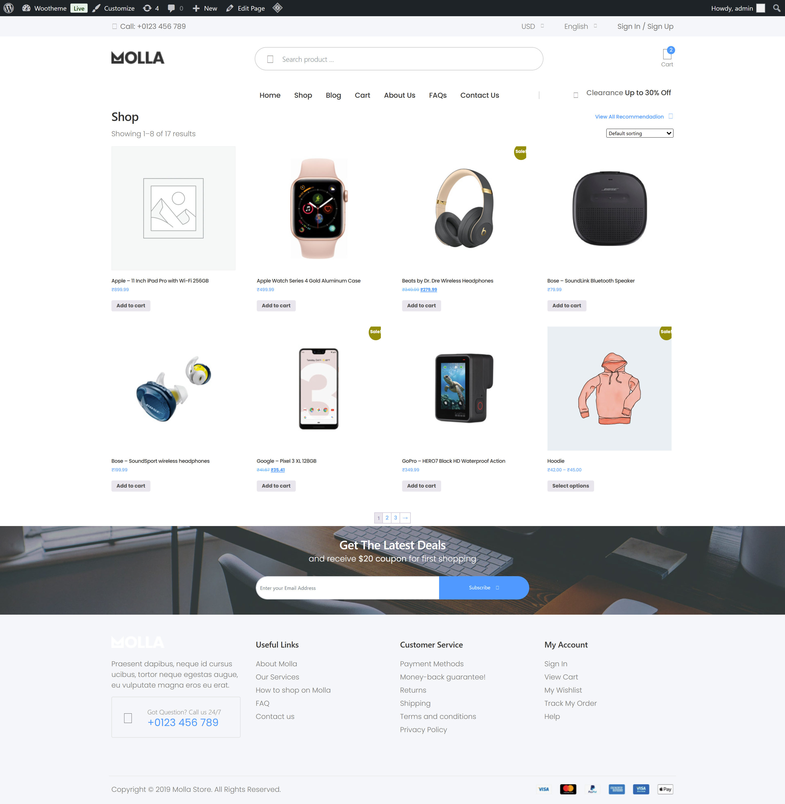
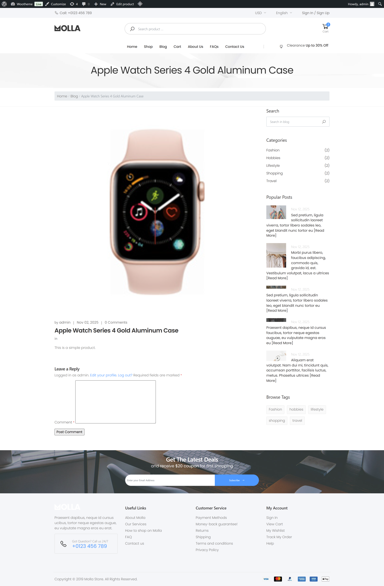

# Molla – Custom WooCommerce E-commerce Theme

## 📖 Overview

Molla is a custom e-commerce WordPress theme developed specifically for the WooCommerce platform.  
The theme was built by converting a static HTML template into a fully dynamic WooCommerce-powered CMS, showcasing strong understanding of both:

- WordPress Template Hierarchy  
- WooCommerce Template Override System  

The project focuses on clean code, fast performance, and seamless dynamic product integration.  
No page builders were used — only native WordPress/WooCommerce hooks, PHP, and Pure CSS.

**🔗 Live Demo:** https://molla-ecommerce-test.infinityfreeapp.com/

---

## 🚀 Key Features

### **WooCommerce Integration**
- Full support for Products, Cart, Checkout, My Account
- Custom templates for essential WooCommerce pages

### **Custom Template Overrides**
- Unique layouts for archive pages, single products, and product loops
- Located inside the `/woocommerce/` override directory

### **Custom Product Fields**
- Additional product metadata fields via WordPress Custom Fields or ACF

### **Advanced Filtering Logic**
- Custom PHP queries for enhanced filtering on product categories and shop archives

### **Pure CSS Design**
- Lightweight styling ≈ faster page loads and improved UX

### **Menus & Widgets**
- Multiple registered widget areas:
  - Product filter sidebar
  - Footer widgets
  - Header navigation menus

---

## 🛠 Tech Stack

**Frontend**  
- HTML5  
- Pure CSS3  

**Backend**  
- PHP  
- WordPress Core API  
- WooCommerce Core  

**Database**  
- MySQL  

**Required Plugin**  
- WooCommerce  

**Optional Plugin**  
- Advanced Custom Fields (ACF)

---

## ⚙️ WooCommerce Template Hierarchy

### **archive-product.php**  
Controls the main Shop page and Product Category pages, including:

- Product loop placement  
- Sidebar filters  
- Custom product order controls  

### **single-product.php**  
Handles:

- Product image gallery  
- Tabs (Description, Additional Info, Reviews)  
- Related products  

### **content-product.php**  
Overrides the product card markup seen in loops (Shop page grids).

### **functions.php**  
Contains hooks to:

- Remove default WooCommerce elements  
- Add custom product data  
- Modify breadcrumbs  
- Control product loop structure  

---

## 🔧 Installation

1. Download/clone this repository.
2. Go to your WordPress installation:
      /wp-content/themes/

3. Upload the **wootheme** folder.
4. Navigate to **WP Admin → Appearance → Themes**.
5. Activate **Molla (wootheme)**.
6. Install required plugin:
   - **WooCommerce**

---

## 📸 Screenshots

> Replace the `src` values below with your actual screenshot images.

<table>
<tr>

<td align="center" style="padding: 10px;">

 <strong>🏠 Homepage (front-page.php)</strong>
</td>

<td align="center" style="padding: 10px;">

 <strong>🛒 Shop Page (archive-product.php)</strong>
</td>

<td align="center" style="padding: 10px;">

 <strong>📦 Single Product (single-product.php)</strong>
</td>

</tr>
</table>

---

## 📝 Author

**Karan Bhanushali**  
WordPress & WooCommerce Developer  

🔗 Portfolio: [*https://karanbhanushali-portfolio-cms.netlify.app/*](https://karanbhanushali-portfolio-cms.netlify.app/)  
🔗 LinkedIn: [*https://www.linkedin.com/in/karan-bhanushali/*](https://www.linkedin.com/in/karan-bhanushali/)

---

## 📄 License

This project is licensed under the **MIT License** — see the `LICENSE.md` file for details.
